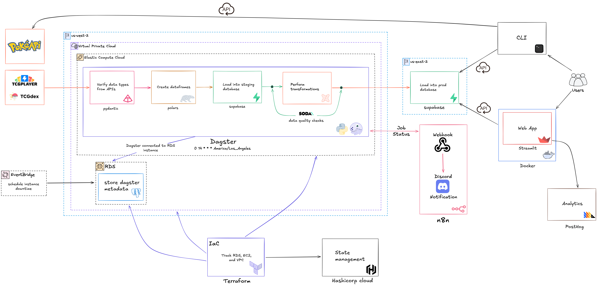

# Card Data

This directory stores all the code for all backend data processing related to Pokémon TCG data.

Instead of calling directly to the PokéAPI for data from the video game, I took this a step further
and decided to process all the data myself, load it into Supabase, and read from that API.

## Data Architecture
Runs at 2:00PM PST daily.

1. TCGPlayer pricing data and TCGDex card data are called and processed through a data pipeline orchestrated by Dagster and hosted on AWS.
    - Dagster runs on an EC2 instance.
    - Dagster metadata is stored separately in RDS.
    - The pricing pipeline is scheduled with cron: `0 14 * * *`.
    - Tournament standings data is also pulled from Limitless.

2. When the pipeline starts, Pydantic validates the incoming API data against a pre-defined schema, ensuring the data types match the expected structure.
    - Invalid or unexpected payloads fail early before data is loaded downstream.

3. Polars is used to create DataFrames.
    - DataFrames are used to clean, normalize, and prepare records for database loading.

4. The data is loaded into a Supabase staging schema.
    - The staging schema acts as the raw/validated landing area before production tables are built.

5. Soda data quality checks are performed.
    - Checks validate expectations such as row counts, required columns, missing values, duplicate keys, and URL formats.

6. dbt runs tests and builds the final tables in a Supabase production schema.
    - dbt transforms staged data into the final public-facing models.
    - The production schema powers TCG/card/tournament queries.

7. Users are then able to query the `pokeapi.co` or supabase APIs for either video game or trading card data, respectively.
    - The CLI uses PokéAPI for video game data.
    - The CLI and Streamlit web app use Supabase for TCG data.
    - Dagster run status is sent through an n8n webhook for Discord notifications.
