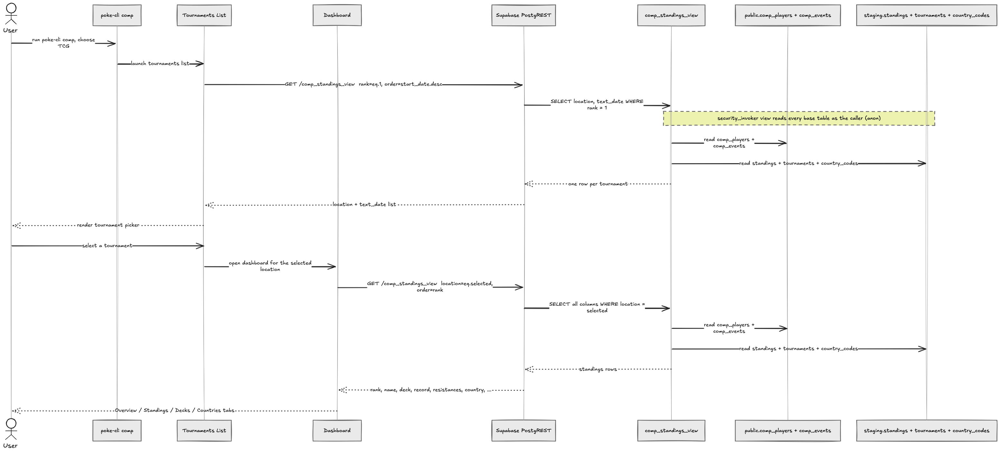

# `comp` TCG Standings Data Flow

How the `poke-cli comp` TCG TUI loads tournament standings, and which tables back the `comp_standings_view` it reads.

## Sequence

## Which tables supply what

`comp_standings_view` is a `security_invoker` view, so each query fans out to five base tables, all read as the calling `anon` role:

| Table | Source | Supplies |
|-------|--------|----------|
| `public.comp_players` | pokedata.ovh | rank, points, record, opp / opp-opp win %, country code |
| `public.comp_events` | pokedata.ovh | location, start/end dates, text_date, type, player_quantity |
| `staging.standings` | Limitless (v1) | deck (archetype), decklist URL |
| `staging.tournaments` | Limitless (v1) | pokedata_id → Limitless tournament_id lookup (the join key) |
| `staging.country_codes` | v1 | player_country (full name from the ISO code) |

The three `staging.*` tables are **internal feeds only**: they live in a non-exposed schema, so they're reachable solely through the view, never as their own REST endpoints. Their in-house replacement is tracked in [`REFACTORING.md`](../../../REFACTORING.md) → Post Version 2 §1–§2.

## Notes

- **Two REST round-trips per session:** the tournament list (`rank=eq.1` → one row per event) and the dashboard (`location=eq.<picked>` → that tournament's standings). Both hit the same view; the dashboard derives the Overview / Decks / Countries tabs client-side from the standings rows.
- **Scope:** the view filters to the **current competitive season** (auto-rolling each fall), so only in-season tournaments appear.
- **Grants:** `anon`/`authenticated` have `SELECT` on the view and on every base table it reads (including the `staging` feeds), required because the view is `security_invoker`.
