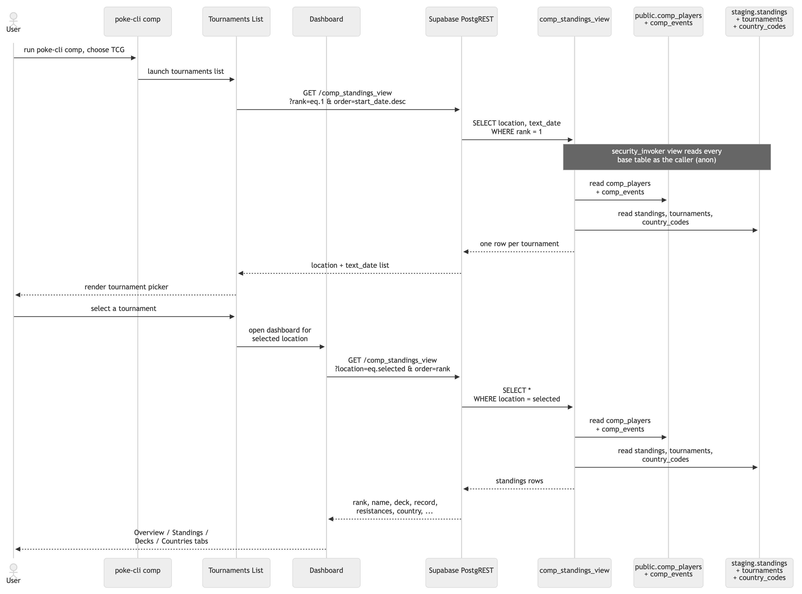

# `comp`

How the `poke-cli comp` TUI loads TCG and VGC tournament standings, and which Supabase views back each branch.

## Shared Flow

The command starts with a competition picker. After the user chooses `TCG` or `VGC`, the selected branch follows the same runtime shape:

1. Fetch one row per current-season tournament for the selected competition type.
2. Let the user pick a tournament.
3. Fetch that tournament's full standings.
4. Derive dashboard tabs client-side from the standings rows.

Both branches make two REST round-trips per session: one for the tournament list and one for the selected tournament dashboard. Both views use the same `security_invoker` + grant pattern, so `anon`/`authenticated` need `SELECT` on the view and on every base table the view reads.

## TCG

The TCG branch reads `comp_tcg_standings_view`. That view joins pokedata.ovh competitive data with Limitless enrichment so the dashboard can show standings, archetypes, decklist links, and country rollups.

### TCG table inputs

| Table | Source | Supplies |
|-------|--------|----------|
| `public.comp_players` | pokedata.ovh | rank, points, record, opp / opp-opp win %, country code |
| `public.comp_events` | pokedata.ovh | location, start/end dates, text_date, type, player_quantity |
| `staging.standings` | Limitless | deck (archetype), decklist URL |
| `staging.tournaments` | Limitless | pokedata_id → Limitless tournament_id lookup (the join key) |
| `staging.country_codes` | Manual Upload | player_country (full name from the ISO code) |

The three `staging.*` tables are **internal feeds only**: they live in a non-exposed schema, so they're reachable solely through the view, never as their own REST endpoints.

### TCG dashboard

The TCG dashboard derives these tabs from the selected tournament's standings rows:

- **Overview:** tournament summary and winner details.
- **Standings:** rank, player, points, record, resistance, country, and deck.
- **Decks:** archetype frequency bar chart.
- **Countries:** player-country frequency bar chart.

## VGC

The VGC branch reads `comp_vgc_standings_view`. It is simpler than the TCG branch because VGC does not use Limitless enrichment; the team data comes from pokedata.ovh decklists.

### VGC table inputs

| Table | Source | Supplies |
|-------|--------|----------|
| `public.comp_players` | pokedata.ovh | rank, points, record, opp / opp-opp win %, country code |
| `public.comp_events` | pokedata.ovh | location, start/end dates, text_date, type, player_quantity |
| `public.comp_vg_decklists` | pokedata.ovh | team JSONB for each player |
| `staging.country_codes` | Manual Upload | player_country (full name from the ISO code) |

### VGC dashboard

The VGC dashboard derives these tabs from the selected tournament's standings rows:

- **Overview:** tournament summary, winner details, and winner's team.
- **Standings:** rank, player, points, record, resistance, country, and team.
- **Usage:** Pokémon usage frequency bar chart derived from each row's `team` array.
- **Countries:** player-country frequency bar chart.

## Shared Notes

- Both standings views filter to the current competitive season, which auto-rolls each fall.
- TCG has a `deck` column sourced from Limitless archetype data.
- VGC has a `team` column sourced from six-Pokémon decklist JSONB data.
