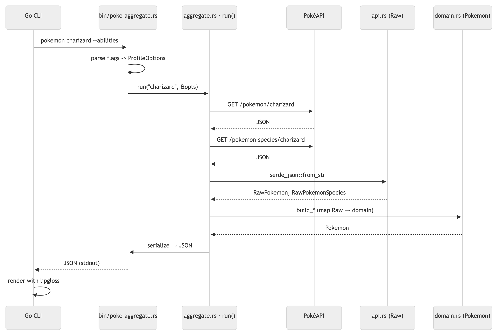

# Rust Aggregation Service

How the Go CLI delegates Pokémon data assembly to the `poke-aggregate` Rust binary, from flag parsing through PokéAPI fetches to the JSON it hands back for rendering.

## Diagram
