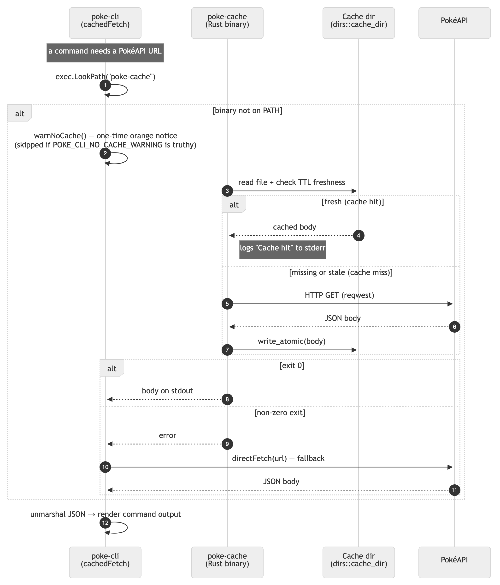

# Rust Caching Service

View the [releases](https://github.com/digitalghost-dev/poke-cli/releases/latest) page to install.

This page decribes how the Go CLI  checks for the `poke-cache` Rust binary, and how it handles the case when it's not found. The caching service is an optional component that provides local caching of PokéAPI responses to speed up repeated queries. If the binary is absent, the CLI will still function but without caching benefits, and it will print a one-time notice to inform the user.

## Diagram
