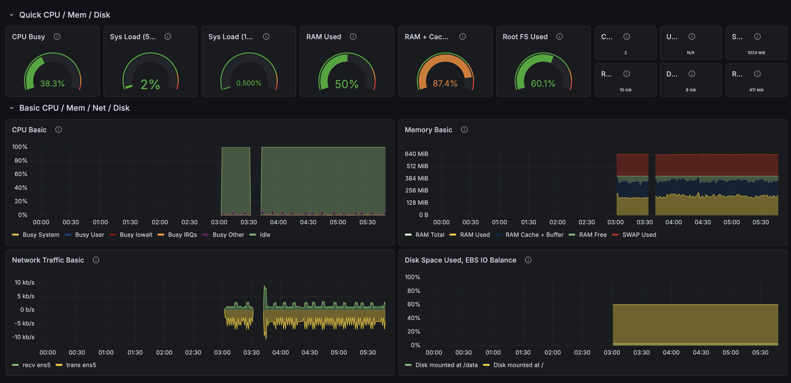

# 7 // Grafana Cloud

!!! question "What is Grafana?"

    Grafana is an open-source observability platform that visualizes metrics, logs, and traces through customizable dashboards. 
    It connects to various data sources like Prometheus, PostgreSQL, and others to provide real-time monitoring with charts, 
    graphs, and alerts. Grafana Cloud is the managed, hosted version that includes pre-configured Prometheus for metrics storage, 
    eliminating the need to run your own infrastructure.

## Overview
Grafana is used to monitor the Supabase PostgreSQL instance. This service is not required for the project,
but a nice to have to view more details about the database's performance. The free tier on Grafana Cloud is
more than enough.

Create an account on [Grafana Cloud](https://grafana.com/auth/sign-up/create-user).

## Create Scrape Job
_A scrape job is responsible for calling the Supabase metrics endpoint._

1. On the homepage, on the left side menu, click on the drop-down for connections and 
choose to [add a new connection](https://digitalghostdev.grafana.net/connections/add-new-connection).
2. Search for Supabase.
3. Give the Scrape Job a name.
4. Supabase recommends to leave the scrape interval to every minute.
5. Input the Supabase project ID. This can be found under Settings > General in Supabase.
6. Input a Supabase secret key. This can be found under Settings > API Keys > Secret Keys in Supabase.
Create a new one for Grafana.
7. Click **Test Connection**.
8. If test connection is successful, click on **Save Scrape Job**.
9. Finally click **Install**.

## Import Supabase Dashboard
_Supabase has a premade dashboard ready for use in a `.json` format that can be imported via the Grafana UI._

1. On the left side menu, click on **Dashboards**.
2. In the upper-right, click on the **New** dropdown, then choose **Import.**
3. Copy or download this `.json` file from 
[supabase/supabase-grafana](https://raw.githubusercontent.com/supabase/supabase-grafana/refs/heads/main/grafana/dashboard.json).
4. Upload or paste the `.json` file or code into the respective section in the Grafana UI.
5. Click **Load**. A prompt should appear to choose a data source. Choose the Prometheus instance that receives the Supabase metrics.
6. The dashboard should be ready to view.

!!! warning

    The `uid` for will need to be updated manually if the prompt for choosing a data source does not appear. If so, the dashboard
    will have errors on each visual. To fix this, perform the steps below.

1. Grab the `uid` for the Prometheus data source.
    * On the left side menu, click on the **Connections** dropdown. Then, choose **Data Sources**.
    * Search for "prom" and then click on the default Prometheus data source.
    * In the URL of that page, the last section is the `uid`: `/datasources/edit/<uid>`.

2. Edit the JSON Model in the Dashboard.
    * Visit the dashboard and then click on **Edit** in the upper-right.
    * Click on **Settings**.
    * Click on the **JSON Model** tab.
    * Grab the JSON code and using a text editor like VS Code, paste the code and search for `"uid": "prometheus"`.
    * Choose to change all occurrences of `"uid": "prometheus"` to `"uid": "<uid>"`
    * Copy the updated JSON code and paste it into the Grafana UI.
    * Save changes and head back to the dashboard.
    
---

Related Supabase [documentation](https://supabase.com/docs/guides/telemetry/metrics/grafana-cloud).