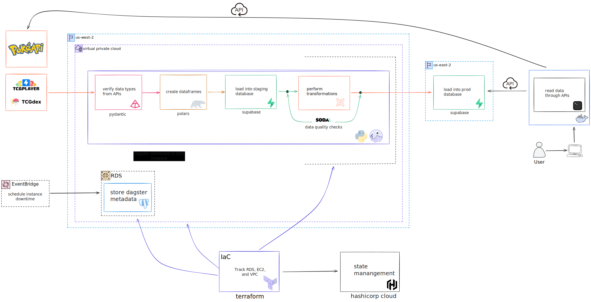

# 1 // Overview

This section serves as a knowledge base for the project’s backend data infrastructure. It was created for a few purposes:

1.	To document how I built everything, so I can easily reference it later.
2.	To help others learn how to build something similar.
3.	To provide a clear understanding of how all the components work together.

This infrastructure guide will be constantly updated as changes or updates to resources occur.

The infrastructure is mainly in support of TCG data since there are multiple data sources that are being used to support the CLI/TUI.
The VGC data simply calls one API.

!!! warning

    All of the commands ran for this project in the terminal are based on macOS (i.e., Homebrew to install packages). 
    If building on a different operating system, please find the equivalent command. Links will be provided for install 
    guides for all operating systems when possible.

## Data Infrastructure Diagram

1. TCGPlayer pricing data and TCGDex card data are called and processed through a data pipeline orchestrated by Dagster
and hosted on AWS.
2. When the pipeline starts, Pydantic validates the incoming API data against a pre-defined schema, ensuring the data 
types match the expected structure.
3. Polars is used to create DataFrames.
4. The data is loaded into a Supabase staging schema.
5. Soda data quality checks are performed.
6. `dbt` runs tests and builds the final tables in a Supabase production schema.
7. Users are then able to query the `pokeapi.co` or `supabase` APIs for either video game or trading card data, respectively.

## Tools & Services

Below is a list of all the tools and services used in this project's infrastructure:

- AWS
    - RDS
    - S3
    - VPC
    - EC2
- Dagster
- Polars
- Supabase
- Terraform

!!! note

    Keep in mind that the purpose of this project is to explore and learn new tools, services, and programming languages.
    Some design choices might be overkill or not make much sense at all, but included purely for learning.

    I'm not an expert! If you notice anything strange or think something could be improved, 
    please feel free to open a [GitHub Issue](https://github.com/digitalghost-dev/poke-cli/issues) and offer a suggestion.