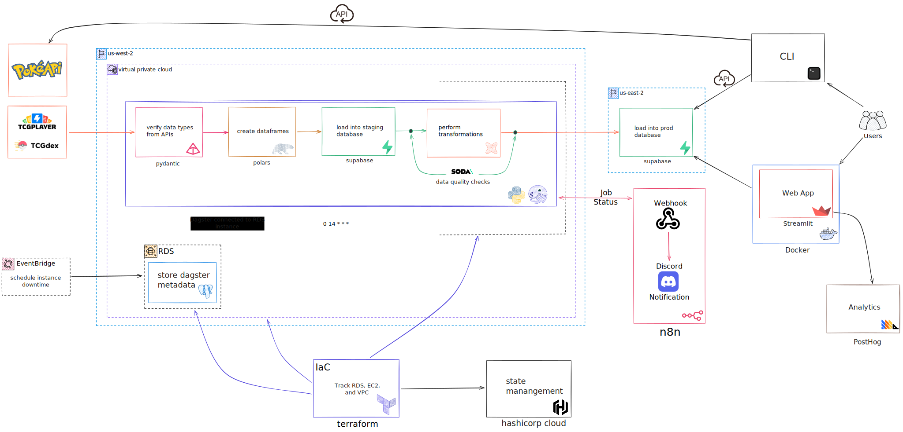

# 1 // Overview

This section serves as a knowledge base for the project’s backend data infrastructure. It was created for a few purposes:

1.	To document how I built everything, so I can easily reference it later.
2.	To help others learn how to build something similar.
3.	To provide a clear understanding of how all the components work together.

This infrastructure guide will be constantly updated as changes or updates to resources occur.

To view information about the CLI architecture and how it works behind the scenes, check out the [CLI Architecture](../Architecture/index.md) documentation.

!!! warning

    All of the commands ran for this project in the terminal are based on macOS (i.e., Homebrew to install packages). 
    If building on a different operating system, please find the equivalent command. Links will be provided for install 
    guides for all operating systems when possible.

## Data Infrastructure Diagram

1. TCGPlayer pricing data, TCGDex card data, pokedata.ovh competitive data, PokéAPI CSV exports, and Pikalytics pages are processed through pipelines orchestrated by Dagster and hosted on AWS.
    - Dagster runs on an EC2 instance.
    - Dagster metadata is stored separately in RDS.
    - The pricing pipeline is scheduled with cron: `0 14 * * *`.
    - PokéAPI reference data refreshes on the 1st and 15th of each month.
    - Pikalytics scrapers run weekly through Dagster-triggered n8n workflows.

2. Extract assets call the source APIs or trigger n8n scraper webhooks.
    - n8n only extracts raw Pikalytics rows into Supabase staging tables.
    - Dagster blocks on those webhook calls so dbt does not build against stale staging data.

3. Polars is used to create DataFrames for the Python-owned API pipelines.
    - DataFrames are used to clean, normalize, and prepare records for database loading.

4. The data is loaded into a Supabase staging schema.
    - The staging schema acts as the raw/validated landing area before production tables are built.

5. Soda data quality checks are performed.
    - Checks validate expectations such as row counts, required columns, missing values, duplicate keys, and URL formats.

6. dbt runs tests and builds the final tables in a Supabase production schema.
    - dbt transforms staged data into the final public-facing models.
    - The production schema powers card, tournament, PokéAPI-reference, and Pikalytics queries.

7. Users are then able to query the `pokeapi.co` or `supabase` APIs for either video game or trading card data, respectively.
    - The CLI uses PokéAPI for video game data.
    - The CLI and Streamlit web app use Supabase for TCG card data, competitive standings, and supporting competitive tables.
    - Dagster run status is sent through an n8n webhook for Discord notifications.

## Tools & Services

Below is a list of all the tools and services used in this project's infrastructure:

- AWS
    - RDS
    - S3
    - VPC
    - EC2
- Dagster
- dbt
- Firecrawl
- n8n
- Polars
- Supabase
- Terraform

!!! note

    This project is a learning playground for exploring new tools, services, and programming languages.
    Some design choices are intentionally experimental or may not follow conventional patterns.
    That's part of the learning process!
    
    Feedback and suggestions are always welcome! If you spot an issue or have ideas for improvement,
    please open a [GitHub Issue](https://github.com/digitalghost-dev/poke-cli/issues).
