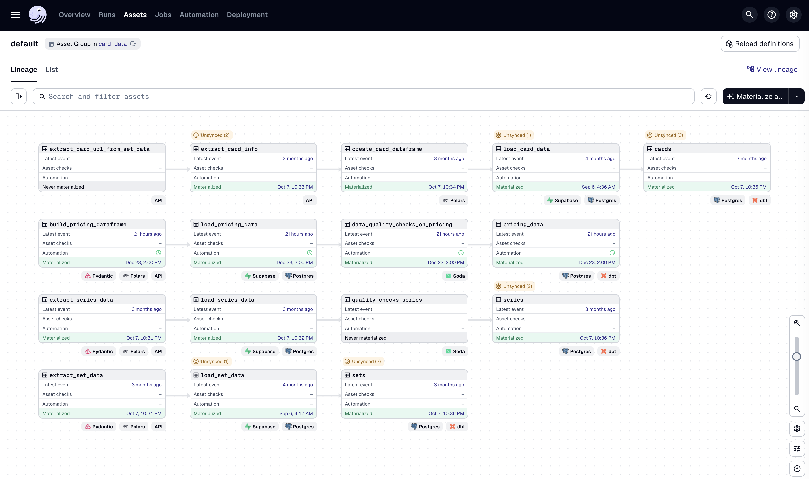

# 3 // Local Deployment
This page covers setting up Python, Dagster, dbt, and Soda for local development. 
Dagster is introduced early so that the pipelines can be run first. dbt and Soda 
require data in Supabase to function, so this order lets each tool be tested as the 
page progresses. 

The [4. AWS](aws.md) section will show how to deploy this solution on the cloud.

## Python

First, create a directory for all the Python code. This project's Python directory is called `card_data`.
Once the directory is created, `cd` into it from the terminal.

All following commands will take place in this directory.

### Installing uv
_uv is the main package and project manager used in this project. Learn more about [uv](https://docs.astral.sh/uv/)._

1. Install via their [installation script](https://docs.astral.sh/uv/getting-started/installation/):
    ```bash
    curl -LsSf https://astral.sh/uv/install.sh | sh
    ```
   or brew:
    ```bash
    brew install uv
    ```
2. Install Python with `uv`:
    ```bash
    uv python install 3.12
    ```
   
3. Initialize `uv` to set up project files. This will create a `pyproject.toml` file if one does not already exist:
    ```bash
    uv init
    ```
   
4. Sync `uv` with the libraries from `card_data/pyproject.toml`. Syncing ensures that all project dependencies are installed and up-to-date with the lockfile.
    ```bash
    uv sync
    ```
   
### ELT Files
The files used for extracting, loading, then transforming the data all live in the `pipelines/defs/` directory.
At the time of writing, the `extract/` and `load/` directories have 2 different files aimed at calling different APIs.
One for card data from [tcgdex](https://tcgdex.dev/) and the other for pricing data from [tcgcsv](https://tcgcsv.com/).

```
.
└── pipelines/
    └── defs/
        ├── extract/
        │   ├── extract_data.py
        │   └── extract_pricing_data.py
        ├── load/
        │   ├── load_data.py
        │   └── load_pricing_data.py
        └── transform/
            └── transform_data.py 
```

---

## Dagster

!!! question "What is Dagster?"

    Dagster is an open-source data orchestration tool that helps you build, run, and monitor your data pipelines. 
    It’s designed to make working with data workflows more reliable and maintainable, giving you clear visibility 
    into each step and making it easier to catch issues before they cause problems.

    View more [about Dagster](https://dagster.io/platform-overview)

### Configuring
Dagster and its components needed for the project can be installed with `uv`:

```bash
uv add dagster dagster-webserver dagster-dg-cli dagster-postgres>=0.27.3 dagster-dbt
```

This will add the libraries to `pyproject.toml` file.

To run the Dagster service and web server, run the following in the correct directory with `.venv` active:
```shell
dg dev
```

The web UI can be viewed at `http://127.0.0.1:3000`

### Running the Pipelines

With Dagster running, the pipelines can be triggered to populate data in Supabase. 
This step is required before dbt or Soda will work since both tools expect data to already 
exist in the staging tables.

This project currently has 4 pipelines:
* Card data
* Set data
* Series data
* Pricing data



1. Open the Dagster UI at `http://127.0.0.1:3000`.
2. On the top bar, click on **Assets**.
3. Select the assets to materialize. For initial setup, select:
    - `extract_series_data`
    - `extract_set_data`
    - `load_series_data`
    - `load_set_data`
4. Click **Materialize selected** in the top right.
5. Monitor the run in the **Runs** tab. Once complete, the data will be available in the Supabase `staging` schema.

!!! note

    The load assets depend on extract assets, so Dagster will automatically run them in the correct order.

---

## dbt (Data Build Tool)

!!! question "What is dbt?"

    dbt (data build tool) is a command-line tool that enables data analysts and engineers to transform data 
    in warehouses using SQL. The tool allows users to write modular SQL queries as "models" that build upon 
    each other, automatically managing dependencies and enabling version control, testing, and documentation 
    of data transformations. dbt compiles SQL models into executable queries and runs them in the proper order,
    turning raw data into analysis-ready datasets.

    View more [about dbt](https://www.getdbt.com/product/what-is-dbt)

### Installation & Initialization

Install with `uv`:
```bash
uv add dbt
```

This will add the libraries to `pyproject.toml` file.

Initialize a `dbt` project in the `card_data` directory:
```bash
dbt init
```

Follow the prompts to finish setting up the `dbt` project.

### Models
Models are the pieces of SQL code that run when using that `dbt build` command that _build_ the
tables to the destination schema. In this project, that would the `public` schema in the PostgreSQL
database on Supabase.

The `public` schema is the public facing schema that exposes the API to the data in the tables.

### Sources
Create a `sources.yml` file under the `models/` directory. 
More info on [sources here](https://docs.getdbt.com/docs/build/sources).

This file is used to declare and configure the raw data sources. These tables are the foundation for
the dbt models but are not managed by dbt itself.

For example:
```yaml
sources:
  - name: staging
    description: "Staging schema containing raw data loaded from extract pipeline"
    tables:
      - name: series
        description: "Pokemon card series data"
        columns:
          - name: id
            description: "Unique series identifier"
          - name: name
            description: "Series name"
          - name: logo
            description: "Series logo URL"
```

The above `yml` defines the structure for the raw `series` table from the `staging` schema.

---

## Soda

!!! question "What is Soda?"

    Soda is a data quality platform that helps monitor, test, and validate data in warehouses, 
    lakes, and pipelines. It uses a simple YAML-based language (SodaCL) to define data quality checks—
    like testing for null values, schema changes, freshness issues, or anomalies—and runs them
    automatically on your data sources. Soda integrates with popular data platforms (Snowflake,
    BigQuery, Postgres, etc.) and can alert when data quality issues are detected, helping
    catch problems before they impact downstream analytics or ML models.

    View more about [Soda](https://soda.io/)

### Configuring & Running

Soda and its components needed for the project can be installed with `uv`:

1. Install Soda Core with PostgreSQL connector since Supabase uses PostgreSQL.
   Other [connectors](https://github.com/sodadata/soda-core/blob/main/docs/installation.md#compatibility) can be used.
```shell
   uv add soda-core-postgres
```

2. Create a `configuration.yml` and `checks.yml` files under the `card_data/pipelines/soda/` directory.

    * The `configuration.yml` holds the information for connecting to the data source. The below is an example from this project that reads the `username` and `password`
      from the local environment so that this file can be safely committed to `git` and pushed to GitHub.
```yaml
data_source supabase:
  type: postgres
  connection:
    host: aws-0-us-east-2.pooler.supabase.com
    port: '5432'
    username: ${SUPABASE_USER}
    password: ${SUPABASE_PASSWORD}
    database: postgres
    schema: staging
```

    * The `checks.yml` file is where the data quality checks are defined. The below is an example from this project of simple checks being performed on the `series` table in the staging database.
```yaml
checks for series:
  # Row count validation
  - row_count = 4

  # Schema validation checks
  - schema:
      fail:
        when required column missing: [id, name, logo]
        when wrong column type:
          id: text
          name: text
          logo: text

  # Completeness checks (no null values)
  - missing_count(id) = 0
  - missing_count(name) = 0
  - missing_count(logo) = 0

  # Data uniqueness checks
  - duplicate_count(id) = 0
  - duplicate_count(name) = 0

  # Data format validation - URL pattern check
  - invalid_count(logo) = 0:
      valid regex: '^https://.*'
```

3. Once the files are created, set the environment variables for `${SUPABASE_USER}` and `${SUPABASE_PASSWORD}`. These can be found from the connection string as shown in [2 // Supabase](supabase.md):
```shell
export SUPABASE_USER='postgres.<rest-of-username>'
export SUPABASE_PASSWORD='<password>'
```

4. Run a scan by referencing the correct path to both files:
```shell
# replace <supabase> with the correct name from the top line of the configuration.yml file
soda scan -d supabase -c /path/to/configuration.yml /path/to/checks.yml
```

5. Review the output. Running these checks on this project results in:
```txt
[15:25:38] Soda Core 3.5.5
[15:25:40] Scan summary:
[15:25:40] 8/8 checks PASSED: 
[15:25:40]     series in supabase
[15:25:40]       row_count = 4 [PASSED]
[15:25:40]       Schema Check [PASSED]
[15:25:40]       missing_count(id) = 0 [PASSED]
[15:25:40]       duplicate_count(id) = 0 [PASSED]
[15:25:40]       missing_count(name) = 0 [PASSED]
[15:25:40]       duplicate_count(name) = 0 [PASSED]
[15:25:40]       missing_count(logo) = 0 [PASSED]
[15:25:40]       invalid_count(logo) = 0 [PASSED]
[15:25:40] All is good. No failures. No warnings. No errors.
```