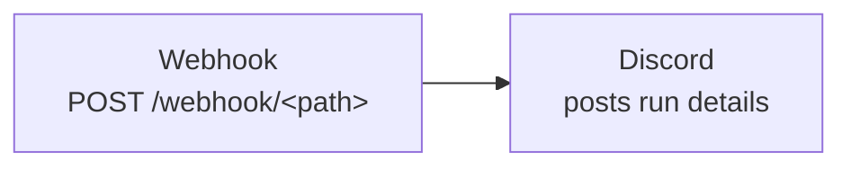
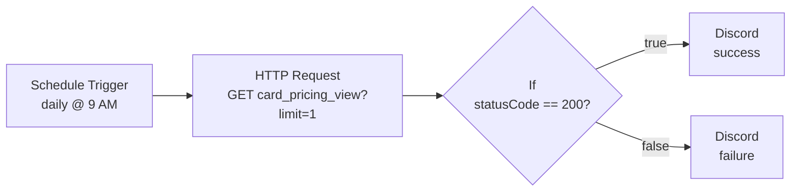
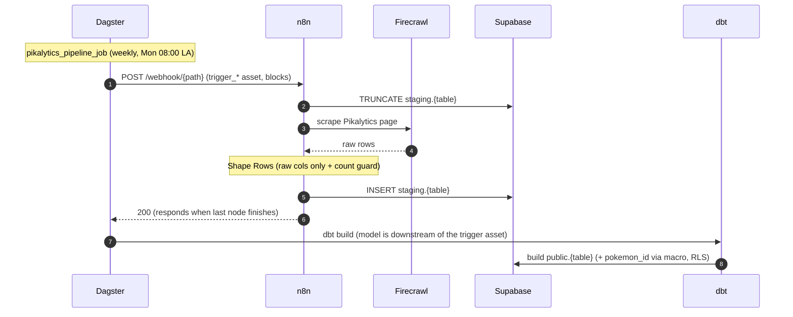
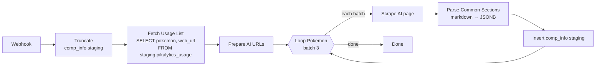

# 8 // n8n

!!! question "What is n8n?"

    n8n is a workflow automation platform that lets you wire together HTTP calls, databases, AI services, and notifications using a visual node editor. Each node is one step in a pipeline; data flows between them as JSON. n8n Cloud is the managed, hosted version where workflows run on n8n's infrastructure.

## Overview

n8n is used in this project for a few different reasons such as performing API status checks, sending success/failure notifications, and ingesting data from sources that aren't exposed as a friendly REST API.

The Pikalytics data, for example, only exists as rendered web pages, so n8n scrapes it with [Firecrawl](https://www.firecrawl.dev/)'s LLM-powered extraction and lands the raw rows in Supabase. These scraper workflows are **triggered by Dagster** — they no longer carry their own schedule. See [Pipeline 3](#pipeline-3-pikalytics-scrapers) and the dedicated [Pikalytics Pipeline](pikalytics-pipeline.md) guide.

This project uses n8n Cloud.

!!! note "Two directions of Dagster ↔ n8n integration"

    * **Dagster → n8n → Discord** (Pipeline 1): Dagster posts run-status webhooks to n8n, which formats and forwards them as Discord alerts.
    * **Dagster → n8n → Supabase** (Pipeline 3): Dagster *triggers* n8n scraper workflows and blocks until they finish loading staging.

    Both use the same keyed `fetch_n8n_webhook_secret(key)` helper to resolve webhook URLs from the `n8n_webhook` AWS secret.

## Create an Account

### n8n

Visit the n8n [sign-up page](https://n8n.io/) to create an account. The Cloud plan is recommended for this
project — it removes the operational overhead of self-hosting.

### Firecrawl

The Pikalytics scrapers ([Pipeline 3](#pipeline-3-pikalytics-scrapers)) use Firecrawl for extraction.

1. Create a [Firecrawl](https://www.firecrawl.dev/signin?view=signup) account to get an API key. The free tier is sufficient for this use case.
2. After account creation, find your API key in the [dashboard](https://www.firecrawl.dev/app/api-keys) and copy it.
3. Add it in n8n as the `Firecrawl account` credential — the scraper workflows reference it by that name.

## Current Pipelines
* Pipeline 1 — Dagster Job Status Check &nbsp;(Dagster → n8n → Discord)
* Pipeline 2 — Supabase API Status Check &nbsp;(n8n schedule → Discord)
* Pipeline 3 — Pikalytics Scrapers &nbsp;(Dagster → n8n → Supabase staging)

### Pipeline 1: Job Status Check

_Receives Dagster run lifecycle webhooks and forwards a summary to Discord._

The TCG data pipeline emits a webhook on run completion (success or failure). This workflow accepts the
webhook payload and translates it into a Discord message, giving immediate visibility on pipeline status
without needing to log into the Dagster UI.

#### Pipeline Shape



#### Workflow

##### 1. Webhook

_Public endpoint that Dagster posts to on run completion._

1. Add a **Webhook** node.
2. Configure:
    * **HTTP Method:** `POST`
    * **Path:** a randomized slug (e.g. `dagster-job-alert-webhook-7k9m2x`). The full URL becomes
      `https://<your-n8n-host>/webhook/<path>`.
    * **Authentication:** None
    * **Response:** Immediately
3. No authentication is required on the webhook itself — the random path segment acts as a shared secret.
   Sufficient for a low-value notification stream; rotate the path if it leaks.

##### 2. Discord

_Posts a templated run summary to a Discord channel._

1. Create a Discord server and within the default text channel, create a webhook.
    1. Server Settings
    2. Integrations
    3. Webhooks
    4. New Webhook
    5. Name the webhook and copy the URL.
2. Back in n8n, add a **Discord** node (send a message), connected to the Webhook output.
3. Configure:
    * **Connection Type:** Webhook
    * **Credential for Discord Webhook:** Click on *Set up Credential* and paste the webhook URL from Discord.
3. Set the message content to:

```text
Job:  {{ $json.body.job_name }}
Status: {{ $json.body.status }}
Run ID: {{ $json.body.run_id }}
```

#### Dagster-side Configuration

Dagster's run status sensor (or an asset post-hook) posts a JSON payload of the form:

```json
{
  "job_name": "tcg_pricing",
  "status": "SUCCESS",
  "run_id": "abc123..."
}
```

to the n8n webhook URL on every run completion. The status field is one of `SUCCESS` or `FAILURE`.

---

### Pipeline 2: API Status Check

_Daily health check on the Supabase TCG API. Posts the result to Discord either way._

Catches outages or breaking changes on the `card_pricing_view` REST endpoint that powers the `card`
command's pricing data. A daily heartbeat is enough — this isn't synthetic monitoring of every endpoint,
just a smoke test that the most user-facing view is reachable.

#### Pipeline Shape



#### Workflow

##### 1. Schedule Trigger

_Fires the workflow once a day._

1. Add a **Schedule Trigger** node.
2. Set the rule to trigger at hour `9` (the n8n default uses the workflow's configured timezone — UTC unless overridden).

##### 2. HTTP Request

_Hits the Supabase REST view with a 1-row limit to confirm the endpoint is reachable._

1. Add an **HTTP Request** node, connected to the Schedule Trigger.
2. Configure:
    * **Method:** `GET`
    * **URL:** `https://<your-supabase-project>.supabase.co/rest/v1/card_pricing_view?limit=1`
    * **Send Headers:** enabled, with three header parameters:
        * `apikey`: your Supabase publishable key
        * `Authorization`: `Bearer <publishable-key>`
        * `Content-Type`: `application/json`
    * **Response → Full Response:** enabled — this passes through the HTTP status code (not just the body)
      so the next node can branch on it.

!!! note

    The publishable key (`sb_publishable_*`) is designed to be safe to expose client-side and is sufficient
    for read-only health checks. Do not use the secret/service-role key for this.

##### 3. If

_Branches the flow based on whether the API responded successfully._

1. Add an **If** node, connected to the HTTP Request output.
2. Configure a single condition:
    * **Left value:** `{{ $json.statusCode }}`
    * **Operator:** `number` / `equals`
    * **Right value:** `200`

The True branch goes to the success Discord node; the False branch goes to the failure Discord node.

##### 4. Discord (Success / Failure)

_Posts the result to a Discord channel either way._

Two Discord nodes, one on each branch of the If node. Both use **Webhook** authentication.

* **Success branch:** content `API response check: {{ $json.statusCode }}`
* **Failure branch:** content `API Response Fail: {{ $('HTTP Request').item.json.statusCode }}`

The failure branch references the upstream HTTP Request explicitly because once the If node's False branch
takes over, `$json` reflects the If node's output rather than the original HTTP response.

---

### Pipeline 3: Pikalytics Scrapers

_Four Dagster-triggered workflows that scrape [Pikalytics](https://www.pikalytics.com/) into Supabase `staging.*`. n8n is a **dumb extractor** — all scheduling lives in Dagster and all derivation lives in dbt._

The four workflows fan into a single Dagster job (`pikalytics_pipeline_job`, weekly Mondays 08:00 LA). Each
workflow is a webhook that Dagster POSTs to; the webhook is set to **respond only when its last node
finishes**, so the Dagster trigger asset blocks until staging is fully loaded before dbt runs. This guide
covers the **n8n side**; for the full end-to-end (job, schedule, asset lineage, dbt models, RLS) see the
[Pikalytics Pipeline](pikalytics-pipeline.md) guide.

| Workflow | Webhook path | Scrapes | Lands in |
|---|---|---|---|
| `speed-tiers` | `pikalytics-speed-tier` | speed-tiers page | `staging.pikalytics_speed_tiers` |
| `usage` | `pikalytics-usage` | top-50 usage (pokedex) | `staging.pikalytics_usage` |
| `top-teams` | `pikalytics-top-teams` | top teams | `staging.pikalytics_top_teams` |
| `pokemon-comp-info` | `pikalytics-pokemon-comp-info` | each top-50 Pokémon's AI page | `staging.pikalytics_pokemon_comp_info` |

!!! warning "What changed from the old design"

    Each workflow used to own a **Schedule Trigger** and a Code node that did the math/derivations, then
    upserted into a `public` table with `snapshot_month` / `ingested_at` columns. Now:

    * **Dagster owns scheduling** — one job, one weekly schedule. The workflows lost their schedule triggers
      and only run when Dagster calls them.
    * **n8n only extracts raw rows** into `staging` (full truncate + insert; no snapshot column).
    * **dbt derives everything** when it builds `public`: `pokemon_slug`, `pokemon_id` (via the
      `resolve_pokemon_id` macro), speed-tier math, `wins`/`losses`/`ties`, etc. — all version-controlled.

#### Pipeline Shape (common)

Used by `speed-tiers`, `usage`, and `top-teams`:



#### Workflow (common shape)

`Webhook → Truncate Staging → Firecrawl Scrape → Shape Rows → Insert Staging`

##### 1. Webhook

_Entry point Dagster posts to._

* **HTTP Method:** `POST`
* **Path:** `pikalytics-<x>` (see table above)
* **Respond:** **When Last Node Finishes** — this is what makes the Dagster POST block until the load
  completes, so dbt never runs on stale/empty staging.

There is **no Schedule Trigger** — Dagster owns the cadence.

##### 2. Truncate Staging

A **Postgres** node that runs `TRUNCATE` on `staging.pikalytics_<x>` (full-replace each run; the tables have
no snapshot column). Uses the `Postgres account` credential.

##### 3. Firecrawl Scrape

A **Firecrawl** node (`/scrape`) against the relevant Pikalytics URL. The flat tables use Firecrawl's JSON
mode with a schema describing just the raw columns; the LLM extraction returns one object per row. Uses the
`Firecrawl account` credential.

##### 4. Shape Rows

A **Code** node that keeps **only the raw scraped columns** and applies a row-count guard
(`throw if rows.length < N`) so a layout change on Pikalytics fails loudly instead of writing bad data. No
derivations happen here — that's dbt's job.

##### 5. Insert Staging

A **Postgres** node that inserts the raw rows into `staging.pikalytics_<x>`. JSONB columns (e.g. `top-teams`'
`archetypes` / `pokemon`) are `JSON.stringify`-d in the column mapping.

#### Variant: `pokemon-comp-info` (per-Pokémon loop)

This one enriches each of the top-50 usage Pokémon, so it reads the usage list first and loops:



* It reads **`staging.pikalytics_usage`** (the freshly-loaded list), so its Dagster trigger
  (`trigger_pikalytics_pokemon_comp_info`) **depends on `trigger_pikalytics_usage`** — usage loads first,
  then comp-info reads it. This is the only cross-workflow dependency in the pipeline.
* The **Parse Common Sections** Code node parses the scraped markdown into four JSONB arrays
  (`common_moves`, `common_abilities`, `common_items`, `common_teammates`) of `{name, usage_percent}`. This
  is genuine *extraction* (structuring a scraped page), so it stays in n8n; `pokemon_id` is still derived in
  dbt.
* It's a long run (~50 page scrapes), so the trigger asset uses a generous timeout and limited retries.

#### Dagster + Secrets Wiring

* Each workflow is fired by a `trigger_pikalytics_*` asset in `pipelines/defs/pikalytics/`, which POSTs the
  webhook URL resolved via `fetch_n8n_webhook_secret("pikalytics-<x>")` (keys in the `n8n_webhook` AWS
  secret).
* n8n nodes authenticate with the `Postgres account` (truncate / fetch / insert) and `Firecrawl account`
  (scrape) credentials.
* The workflow must be **published/active** for its production webhook URL to respond — if it's toggled off,
  the trigger asset fails with a 404.

#### Verifying

After a run of `pikalytics_pipeline_job`:

1. Confirm `staging.pikalytics_<x>` and `public.pikalytics_<x>` row counts match.
2. Confirm `pokemon_id` is non-null (it's resolved against the `public.pokemon` hub in dbt).
3. For `pokemon-comp-info`, confirm the four `common_*` JSONB arrays are populated.

---

Related: [Pikalytics Pipeline](pikalytics-pipeline.md) | [Supabase](supabase.md) | [AWS](aws.md) | [Grafana Cloud](grafana.md)
