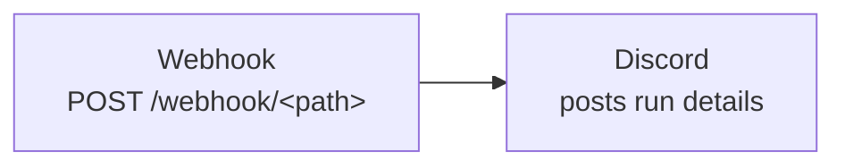
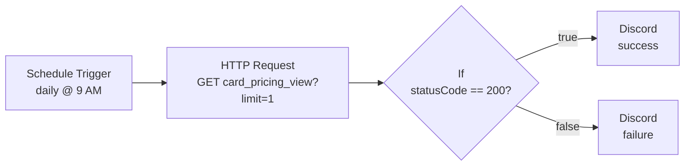
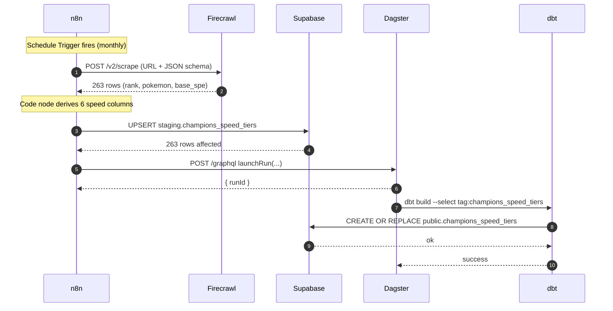

# 8 // n8n

!!! question "What is n8n?"

    n8n is a workflow automation platform that lets you wire together HTTP calls, databases, AI services, and notifications using a visual node editor. Each node is one step in a pipeline; data flows between them as JSON. n8n Cloud is the managed, hosted version where workflows run on n8n's infrastructure on a scheduled configuration.

## Overview

n8n is used in this project for a few different reasons such as performing API status checks, sending success/failure notifications, or ingesting data from sources that are not in a friendly format like a REST API. 

One of n8n pipelines in this project, for example, scrapes `.md` files from [Pikalytics](https://www.pikalytics.com/ai/speed-tiers) with Firecrawl's LLM-powered extraction service to pull structured speed tier data into Supabase.

This project uses n8n cloud.

## Current Pipelines
* Pipeline 1 - Dagster Job Status Check
* Pipeline 2 - Supabase API Status Check
* Pipeline 3 - Champions Speed Tiers Scrape

### Pipeline 1: Job Status Check

_Receives Dagster run lifecycle webhooks and forwards a summary to Discord._

The TCG data pipeline emits a webhook on run completion (success or failure). This workflow accepts the
webhook payload and translates it into a Discord message, giving immediate visibility on pipeline status
without needing to log into the Dagster UI.

#### Pipeline Shape



#### Workflow

##### 1. Webhook

_Public endpoint that Dagster posts to on run completion._

1. Add a **Webhook** node.
2. Configure:
    * **HTTP Method:** `POST`
    * **Path:** a randomized slug (e.g. `dagster-job-alert-webhook-7k9m2x`). The full URL becomes
      `https://<your-n8n-host>/webhook/<path>`.
    * **Authentication:** None
    * **Response:** Immediately
3. No authentication is required on the webhook itself — the random path segment acts as a shared secret.
   Sufficient for a low-value notification stream; rotate the path if it leaks.

##### 2. Discord

_Posts a templated run summary to a Discord channel._

1. Create a Discord server and within the default text channel, create a webhook.
    1. Server Settings
    2. Integrations
    3. Webhooks
    4. New Webhook
    5. Name the webhook and copy the URL.
2. Back in n8n, add a **Discord** node (send a message), connected to the Webhook output.
3. Configure:
    * **Connection Type:** Webhook
    * **Credential for Discord Webhook:** Click on *Set up Credential* and paste the webhook URL from Discord.
3. Set the message content to:

```text
Job:  {{ $json.body.job_name }}
Status: {{ $json.body.status }}
Run ID: {{ $json.body.run_id }}
```

#### Dagster-side Configuration

Dagster's run status sensor (or an asset post-hook) posts a JSON payload of the form:

```json
{
  "job_name": "tcg_pricing",
  "status": "SUCCESS",
  "run_id": "abc123..."
}
```

to the n8n webhook URL on every run completion. The status field is one of `SUCCESS` or `FAILURE`.

---

### Pipeline 2: API Status Check

_Daily health check on the Supabase TCG API. Posts the result to Discord either way._

Catches outages or breaking changes on the `card_pricing_view` REST endpoint that powers the `card`
command's pricing data. A daily heartbeat is enough — this isn't synthetic monitoring of every endpoint,
just a smoke test that the most user-facing view is reachable.

#### Pipeline Shape



#### Workflow

##### 1. Schedule Trigger

_Fires the workflow once a day._

1. Add a **Schedule Trigger** node.
2. Set the rule to trigger at hour `9` (the n8n default uses the workflow's configured timezone — UTC unless overridden).

##### 2. HTTP Request

_Hits the Supabase REST view with a 1-row limit to confirm the endpoint is reachable._

1. Add an **HTTP Request** node, connected to the Schedule Trigger.
2. Configure:
    * **Method:** `GET`
    * **URL:** `https://<your-supabase-project>.supabase.co/rest/v1/card_pricing_view?limit=1`
    * **Send Headers:** enabled, with three header parameters:
        * `apikey`: your Supabase publishable key
        * `Authorization`: `Bearer <publishable-key>`
        * `Content-Type`: `application/json`
    * **Response → Full Response:** enabled — this passes through the HTTP status code (not just the body)
      so the next node can branch on it.

!!! note

    The publishable key (`sb_publishable_*`) is designed to be safe to expose client-side and is sufficient
    for read-only health checks. Do not use the secret/service-role key for this.

##### 3. If

_Branches the flow based on whether the API responded successfully._

1. Add an **If** node, connected to the HTTP Request output.
2. Configure a single condition:
    * **Left value:** `{{ $json.statusCode }}`
    * **Operator:** `number` / `equals`
    * **Right value:** `200`

The True branch goes to the success Discord node; the False branch goes to the failure Discord node.

##### 4. Discord (Success / Failure)

_Posts the result to a Discord channel either way._

Two Discord nodes, one on each branch of the If node. Both use **Webhook** authentication.

* **Success branch:** content `API response check: {{ $json.statusCode }}`
* **Failure branch:** content `API Response Fail: {{ $('HTTP Request').item.json.statusCode }}`

The failure branch references the upstream HTTP Request explicitly because once the If node's False branch
takes over, `$json` reflects the If node's output rather than the original HTTP response.

---

### Pipeline 3: Speed Tiers Scrape

#### Pipeline Shape



#### Create an Account

Visit the n8n [sign-up page](https://n8n.io/) to create an account. The Cloud plan is recommended for this project —
it removes the operational overhead of self-hosting.

#### Supabase: Create the Staging Table

_Run this SQL in the Supabase SQL Editor once before configuring the n8n workflow._

```sql
-- This should already exist from the initial Supabase setup
create schema if not exists staging;

create table if not exists staging.champions_speed_tiers (
    snapshot_month     date          not null,
    format             text          not null,
    rank               int           not null,
    pokemon            text          not null,
    base_spe           int           not null,
    neutral_0_sp       int           not null,
    neutral_32_sp      int           not null,
    max_speed          int           not null,
    neg_spe_0_sp       int           not null,
    max_scarf          int           not null,
    neutral_32_scarf   int           not null,
    ingested_at        timestamptz   not null default now(),
    primary key (snapshot_month, format, pokemon)
);

create index if not exists idx_speed_tiers_rank
    on staging.champions_speed_tiers (snapshot_month, format, rank);
```

The composite primary key on `(snapshot_month, format, pokemon)` makes the upsert idempotent. re-runs within the same
month overwrite rather than duplicate.

#### Workflow

##### 1. Schedule Trigger

_Fires the workflow on a monthly cadence._

1. Add a **Schedule Trigger** node.

2. Set the cron expression to `0 8 5 * *` (8 AM UTC on the 5th of each month).

3. Pikalytics regenerates its AI endpoints around the 1st of each month — running on the 5th gives a buffer in case
   regeneration is delayed.

##### 2. Firecrawl Scrape

_Hits Pikalytics' AI markdown endpoint and extracts structured rows via Firecrawl's JSON mode._

1. Create a [Firecrawl](https://www.firecrawl.dev/signin?view=signup) account to get an API key. The free tier is sufficient for this use case.
2. After account creation, find your API key in the [dashboard](https://www.firecrawl.dev/app/api-keys) and copy it.
3. In n8n, add a **Firecrawl** node.
4. Set up the credential with your Firecrawl API key.
5. Configure the node:
    * **Resource:** `Scraping`
    * **Operation:** `/scrape`
    * **URL:** `https://www.pikalytics.com/ai/speed-tiers`
6. Under **Scrape Options**, add **Formats** and configure:
    * **Type:** JSON
    * **Prompt:** `Extract every row from the Champions Speed Tiers table. Each row maps to one Pokemon. Do not skip any rows.`
    * **Schema:**
        ```json
        {
          "type": "object",
          "properties": {
            "rows": {
              "type": "array",
              "items": {
                "type": "object",
                "properties": {
                  "rank":     { "type": "integer" },
                  "pokemon":  { "type": "string" },
                  "base_spe": { "type": "integer" }
                },
                "required": ["rank", "pokemon", "base_spe"]
              }
            }
          }
        }
        ```
7. Set **Timeout (Ms)** to `120000`. The LLM extraction takes ~55 seconds for 263 rows.
8. Leave **Only Main Content** enabled.

!!! note "Why only 3 fields?"

    Pikalytics' speed tier table has 9 columns, but the other 6 are deterministic functions of `base_spe`
    (Champions uses fixed level 50, max 32 Skill Points, 31 IVs). Asking the LLM to emit all 9 fields × 263 rows
    pushes past Firecrawl's completion limits and times out. Asking for just `rank`, `pokemon`, `base_spe`
    succeeds reliably and lets us derive the rest in the next node.

##### 3. Code (Math + Metadata)

_Derives the remaining six speed columns from `base_spe` and stamps each row with snapshot metadata._

1. Add a **Code** node, connected to Firecrawl's output.
2. Set **Mode** to `Run Once for All Items` and **Language** to `JavaScript`.
3. Paste:

```javascript
const fc = $input.first().json.data.json.rows;

const today = new Date();
const snapshotMonth = `${today.getFullYear()}-${String(today.getMonth() + 1).padStart(2, '0')}-01`;

const rows = fc.map(r => {
  const neutral_0_sp  = r.base_spe + 20;
  const neutral_32_sp = r.base_spe + 52;
  const max_speed     = Math.floor(neutral_32_sp * 1.1);
  return {
    snapshot_month:    snapshotMonth,
    format:            "gen9championsvgc2026",
    rank:              r.rank,
    pokemon:           r.pokemon,
    base_spe:          r.base_spe,
    neutral_0_sp,
    neutral_32_sp,
    max_speed,
    neg_spe_0_sp:      Math.floor(neutral_0_sp * 0.9),
    max_scarf:         Math.floor(max_speed * 1.5),
    neutral_32_scarf:  Math.floor(neutral_32_sp * 1.5),
  };
});

if (rows.length < 200) {
  throw new Error(`Speed tiers row count looks wrong: got ${rows.length}, expected ~263`);
}

return rows.map(json => ({ json }));
```

The `rows.length < 200` guard turns silent breakage (e.g. Pikalytics changes the table layout) into a workflow
failure that surfaces immediately rather than letting bad data into Postgres.

The derivation formulas are:

| Column | Formula |
|--------|---------|
| `neutral_0_sp`     | `base_spe + 20` |
| `neutral_32_sp`    | `base_spe + 52` |
| `max_speed`        | `floor((base_spe + 52) * 1.1)` |
| `neg_spe_0_sp`     | `floor((base_spe + 20) * 0.9)` |
| `max_scarf`        | `floor(max_speed * 1.5)` |
| `neutral_32_scarf` | `floor((base_spe + 52) * 1.5)` |

!!! warning "n8n Cloud's Python sandbox"

    The Code node also supports Python, but n8n Cloud runs Python via Pyodide with no standard library access
    (`datetime`, `math`, etc. are all blocked). For this reason JavaScript is the more practical choice for
    transformations inside n8n. Python work for this project lives in the Dagster pipeline instead.

##### 4. Postgres Upsert (Supabase)

_Lands the transformed rows in `staging.champions_speed_tiers` idempotently._

1. Add a **Postgres** node, connected to the Code node's output.
2. Set up the credential with the Supabase **Session Pooler** connection string (port `6543`). The pooler is
   recommended for serverless callers like n8n Cloud.
3. Configure the node:
    * **Operation:** `Insert or Update` (Upsert)
    * **Schema:** `staging`
    * **Table:** `champions_speed_tiers`
    * **Mapping Column Mode:** `Map Automatically` (the JSON keys from the Code node match column names exactly)
    * **Columns to Match On:** `snapshot_month`, `format`, `pokemon`

!!! note

    Supabase requires SSL. If the connection fails with a `pg_hba.conf` error, ensure SSL is enabled in the
    credential settings.

##### 5. Trigger Dagster (Planned)

_Once the staging row lands, n8n hits the Dagster GraphQL endpoint to launch the dbt-materialization job._

This step calls Dagster's `launchRun` mutation against the `dagster-webserver` instance running on EC2.
Because n8n Cloud has dynamic egress IPs, Dagster is fronted by a Cloudflare Tunnel rather than exposed
through the EC2 security group directly.

The HTTP Request node will POST to `https://<tunnel-host>/graphql` with the mutation:

```graphql
mutation LaunchRun($s: JobOrPipelineSelector!) {
  launchRun(selector: $s) {
    __typename
    ... on LaunchRunSuccess { run { runId } }
    ... on PythonError { message }
  }
}
```

Selecting the `champions_speed_tiers_dbt_job` job in the `card_data` repository location.

##### 6. Notify (Planned)

_Posts run status to Discord on success or failure._

A final HTTP Request (or Discord) node sends a webhook with run summary — row count, duration, dbt status —
mirroring the existing Dagster-run notifications described in the [Overview](index.md#data-infrastructure-diagram).

##### 7. Verifying the Pipeline

After the upsert step succeeds:

1. Open Supabase → Table Editor → `staging.champions_speed_tiers`.
2. Confirm 263 rows exist with `snapshot_month` set to the first of the current month.
3. Spot-check a handful of rows against [pikalytics.com/speed-tiers](https://www.pikalytics.com/speed-tiers) —
   for example, Mega Aerodactyl should appear at rank 1 with `base_spe = 150`, `max_speed = 222`.

---

Related: [Supabase](supabase.md) | [AWS](aws.md) | [Grafana Cloud](grafana.md)
